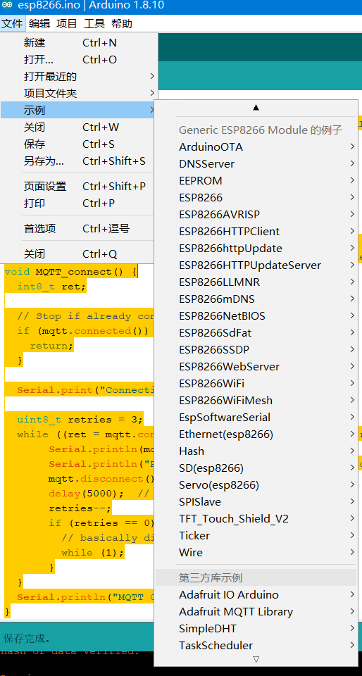

# esp8266RemoteControlPC
使用esp8266远程监控控制pc

代码仅仅是测试代码,使用时候需要自行修改. [开关机,读取温度测试正常.]

测试命令--(mqtt服务器上运行)
开机命令
`mosquitto_pub -t "用户名/feeds/btonoff" -m 1 -u 用户名 -P 密码`  

模拟关机命令
`mosquitto_pub -t "用户名/feeds/btonoff" -m 0 -u 用户名 -P 密码`  

强制断开主电源命令
`mosquitto_pub -t "用户名/feeds/poweronoff" -m 0 -u 用户名 -P 密码`

订阅温度数据命令命令
`mosquitto_pub -t "用户名/feeds/temperature" -m 1 -u 用户名 -P 密码`

mqtt 安装请参考:  在阿里云上安装Mosquitto https://zhuanlan.zhihu.com/p/38040998

arduino模块

关于esp8266使用有问题可以参考:https://blog.csdn.net/solar_lan/article/category/9277412/1
